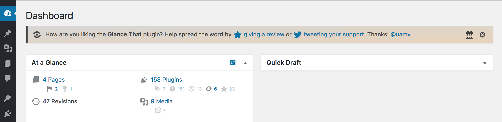
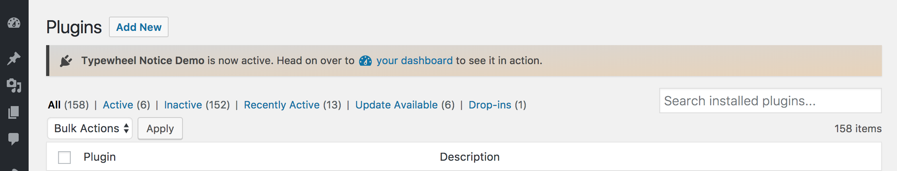
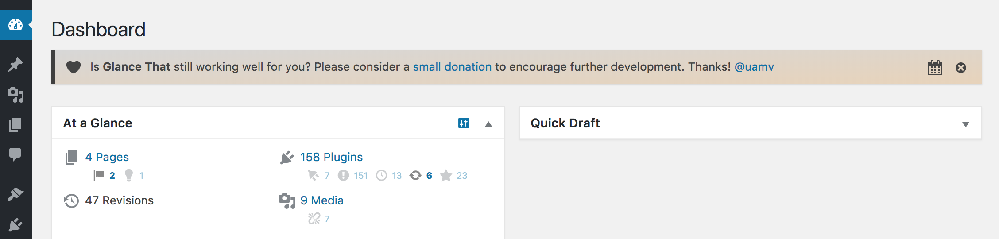

# Typewheel Notice Demo
A WordPress plugin demonstrating how the class Typewheel_Notice operates.
____

## What Makes This Class Unique?
This plugin demonstrates a simple way to implement delayed and dismissible admin notices in WordPress. This implementation of notices is most notably unique in that it…
1. allows any number of unique notices to be added to a plugin.
1. allows dismissal forever or allows for a user to request a reminder in one week or one month.
1. allows the notice to display on any number of admin pages (including those added by other plugins having only a `?page=` parameter in the URL).
1. allows defining a capability per notice which controls the users to whom a notice is shown.
1. implements dismissals on a per user basis.
1. allows full styling of the notice.
1. allows for both a plugin activation notice and delayed notices.

## How to Use it
1. Add the `typewheel-notice/` folder to your root directory.
1. Include the code from `plugin.php` in your root file.
1. Search & replace all instances of `your_prefix_` in the root file. *(prefix should be unique to project)*
1. In the `register_deactivation_hook`, replace `typewheel-notice.php` with the name of your root file.
1. Customize your notices.

## How to Customize a Notice
All of the following arguments can be customized in each notice array

`$prefix . '-unique-notice-id' => array()` *(This array id will be used to track dismissals and must be unique for each notice. Do not modify the $prefix)*

`'trigger' => {true|false}` *(This flags whether or not the notice should be shown)*

`'time' => time() +/- {int}` *(when should the notice be made active? replace {int} with number of seconds before/after activation)*

`'dismiss' => array({week,month})` *(whether to include an option to dismiss for one week or one month)*

`'type' => {success|error|warning|info}` *(optional) (whether to include WP notice styling)*

`'icon' => {dashicon-slug}` *(optional) (prepends a dashicon to the notice)*

`'content' => ''` *(required) (string with content of notice)*

`'style' => array() or ''` *(optional) (array of CSS parameters/values)*

`'location' => array()` *(required) (array of pages on which to show the notice)*

`'capability' => ''` *(optional) (to whom should the notice be shown? defaults to `read`.)*

